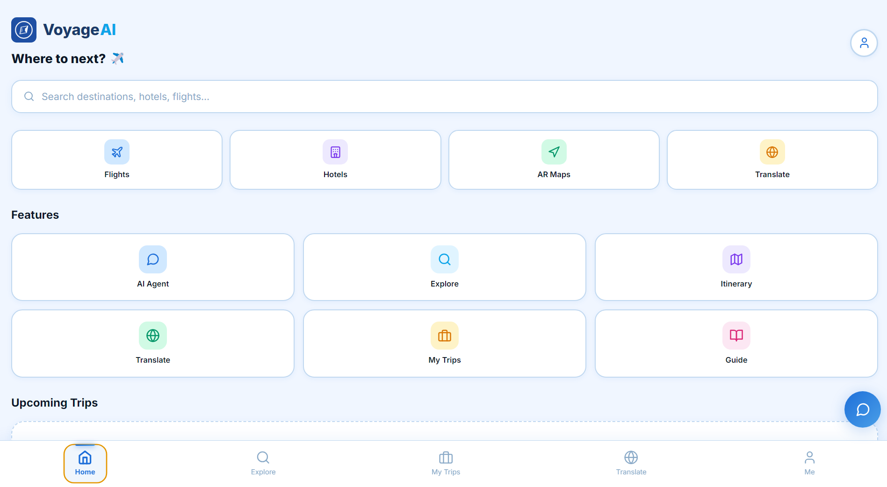
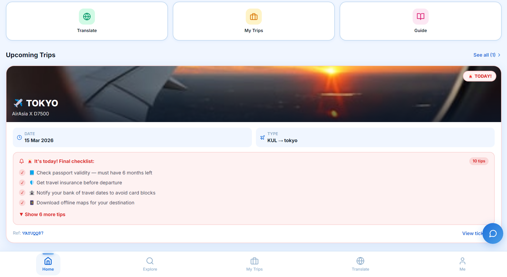
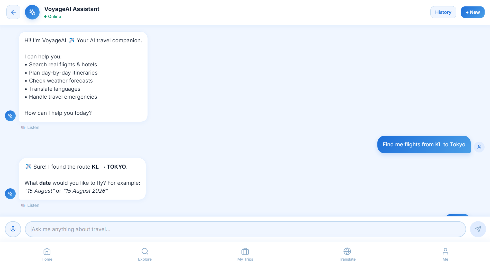
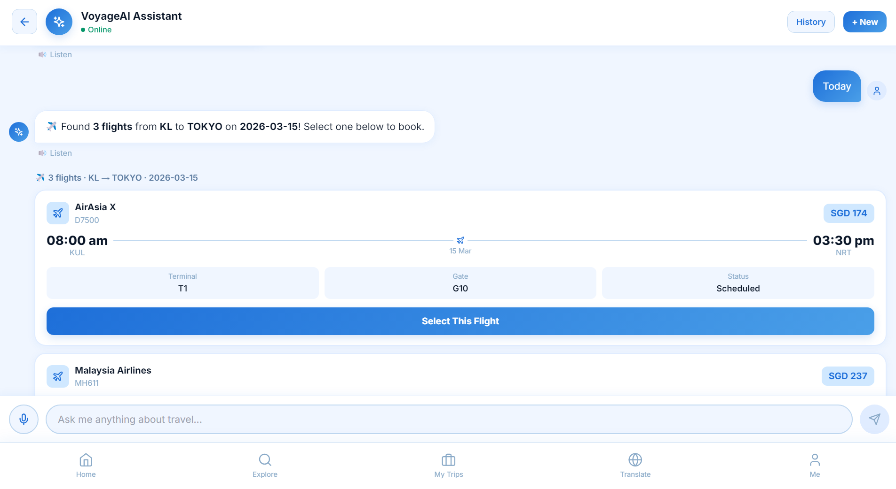
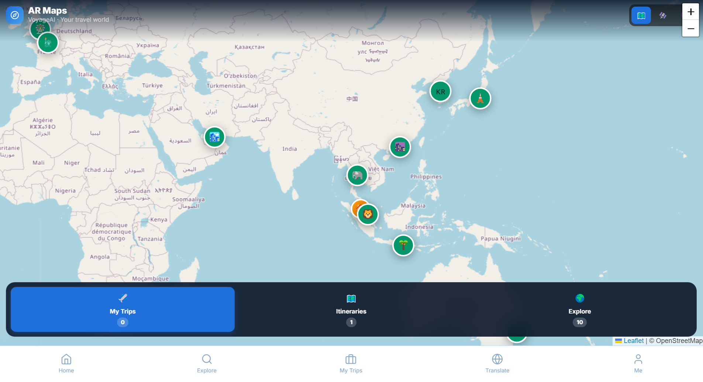
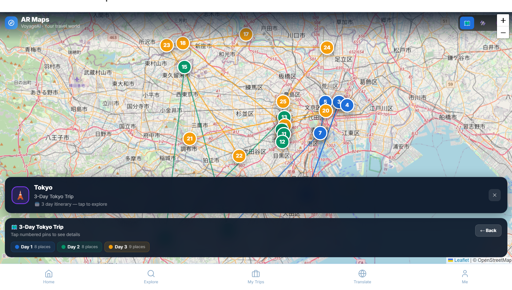
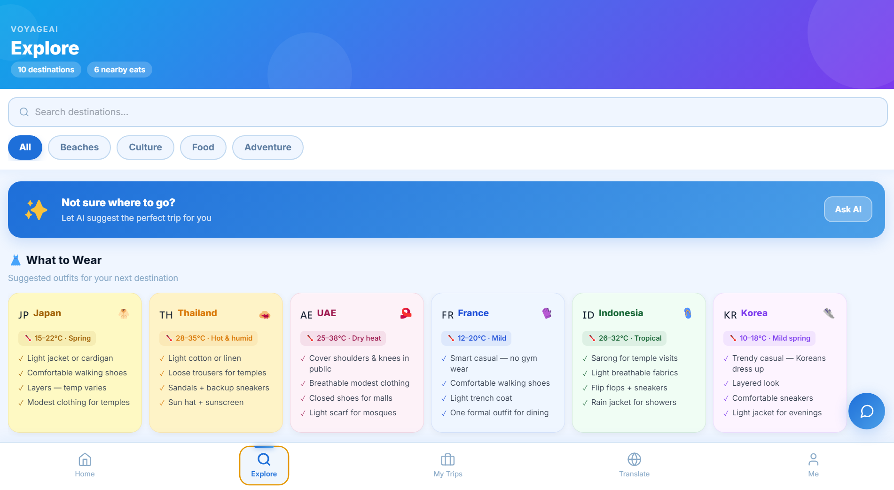
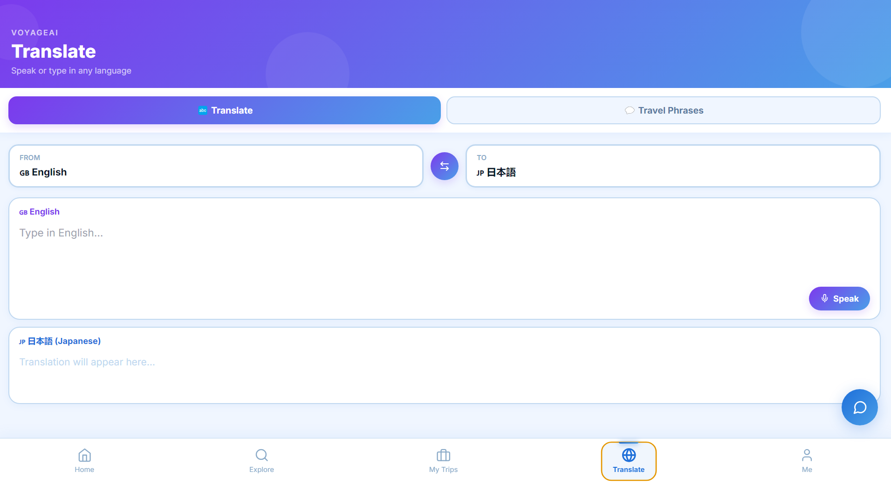

# ✈️ VoyageAI — AI-Powered Travel Assistant

<div align="center">


**An intelligent travel companion built with React, Electron, and Claude AI.**  
Plan trips, book flights & hotels, translate languages, explore destinations — all in one app.

[](https://reactjs.org/)
[](https://electronjs.org/)
[](https://anthropic.com/)
[](https://groq.com/)
[](https://leafletjs.com/)

</div>

---

## 📱 Overview

VoyageAI is a full-featured AI travel assistant desktop app built for the **4th China-ASEAN Innovation and Entrepreneurship Competition**. It combines the power of **Claude AI** for intelligent travel planning with real-time **speech recognition**, **interactive maps**, **flight & hotel search**, **online check-in**, **ticket import**, and **language translation** — all packaged as a cross-platform desktop app.

### ✨ Key Features

| Feature | Description |
|---|---|
| 🤖 **AI Travel Agent** | Chat with Claude AI to plan trips, search flights & hotels, build itineraries |
| ✈️ **Flight Search & Add-ons** | Real-time flights with meal, baggage, seat & extras selection per passenger |
| 🏨 **Hotel Booking** | Search and book hotels with full payment flow |
| 🗺️ **Interactive AR Maps** | Leaflet-powered world map with trip pins, itinerary drilldown, day-coloured route pins |
| 📋 **Smart Itinerary Planner** | AI generates day-by-day plans with colour-coded sections |
| 🌐 **Real-time Translator** | Translate between 15 languages with voice input and TTS output |
| 🧑‍🦯 **Local Guides** | Browse and book local expert guides with reviews and ratings |
| 🔍 **Explore Destinations** | Trending destinations, outfit suggestions, nearby restaurants |
| 💳 **Full Payment Flow** | Multi-passenger checkout with saved cards, passengers & e-tickets |
| 🪑 **Online Check-in** | Interactive seat map with keep/change seat choice, per-passenger boarding passes |
| 📥 **Import Ticket** | Upload any flight/hotel PDF or image — Claude AI extracts and imports it |
| 👤 **User Profiles** | Language, currency, travel style, interests — all personalised |
| 🎙️ **Voice Input** | Groq Whisper speech-to-text across Chat and Translate screens |

---

## 🖥️ Screenshots

<div align="center">
  
  
  
</div>

<div align="center">
  
  
  
</div>

<div align="center">
  
  
</div>

---

## 🏗️ Tech Stack

### Frontend
- **React 18** — UI framework
- **Electron** — Cross-platform desktop wrapper
- **Lucide React** — Icon library
- **Leaflet.js** — Interactive maps (loaded via CDN)

### AI & APIs
| Service | Usage | Cost |
|---|---|---|
| **Anthropic Claude** (`claude-sonnet-4-20250514`) | AI chat, itinerary generation, translation, ticket reading | Pay per token |
| **Groq Whisper** (`whisper-large-v3-turbo`) | Speech-to-text transcription | Free tier available |
| **Aviationstack** | Live flight data | Free tier (100 req/month) |
| **OpenWeather** | Weather data | Free tier |
| **OpenStreetMap / Leaflet** | Map tiles | Free |

---

## 🚀 Getting Started

### Prerequisites

- **Node.js** v18 or higher
- **npm** v9 or higher
- API keys (see [Environment Variables](#environment-variables))

### Installation

```bash
# Clone the repository
git clone https://github.com/YOUR_USERNAME/voyageai.git
cd voyageai

# Install dependencies
npm install
```

### Environment Variables

Create a `.env` file in the root directory:

```env
REACT_APP_CLAUDE_API_KEY=your_anthropic_api_key_here
REACT_APP_AVIATIONSTACK_KEY=your_aviationstack_key_here
REACT_APP_OPENWEATHER_KEY=your_openweather_key_here
REACT_APP_GROQ_API_KEY=your_groq_api_key_here
```

#### Getting API Keys

| Key | Where to get it | Free Tier |
|---|---|---|
| `REACT_APP_CLAUDE_API_KEY` | [console.anthropic.com](https://console.anthropic.com/) | $5 free credits |
| `REACT_APP_GROQ_API_KEY` | [console.groq.com](https://console.groq.com/) | Free (rate limited) |
| `REACT_APP_AVIATIONSTACK_KEY` | [aviationstack.com](https://aviationstack.com/) | 100 req/month free |
| `REACT_APP_OPENWEATHER_KEY` | [openweathermap.org](https://openweathermap.org/api) | 1000 req/day free |

> **Note:** The app includes mock data fallbacks for flights and hotels, so it works even without Aviationstack/OpenWeather keys.

### Running the App

```bash
# Run as desktop app (Electron)
npm run dev

# Run in browser only (React)
npm start

# Build for production
npm run build
```

---

## 📦 Publishing & Distribution

### 🖥️ Desktop App (Electron)

#### Build for your current platform

```bash
# Install electron-builder if not already installed
npm install --save-dev electron-builder

# Add to package.json scripts:
# "dist": "react-scripts build && electron-builder"

npm run dist
```

#### Build for specific platforms

```bash
# Windows (.exe installer)
npm run dist -- --win

# macOS (.dmg)
npm run dist -- --mac

# Linux (.AppImage)
npm run dist -- --linux
```

Add this to your `package.json` for electron-builder config:

```json
"build": {
  "appId": "com.yourname.voyageai",
  "productName": "VoyageAI",
  "icon": "public/logo512.png",
  "files": ["build/**/*", "public/electron.js"],
  "directories": {
    "output": "dist"
  },
  "win": {
    "target": "nsis"
  },
  "mac": {
    "target": "dmg"
  },
  "linux": {
    "target": "AppImage"
  }
}
```

---

### 📱 Mobile App (Capacitor)

Convert to Android/iOS using Capacitor:

```bash
# Install Capacitor
npm install @capacitor/core @capacitor/cli
npm install @capacitor/android @capacitor/ios

# Initialise Capacitor
npx cap init VoyageAI com.yourname.voyageai

# Build the React app
npm run build

# Add platforms
npx cap add android
npx cap add ios

# Sync built files
npx cap sync

# Open in Android Studio
npx cap open android

# Open in Xcode (macOS only)
npx cap open ios
```

#### Android APK
1. Open in Android Studio via `npx cap open android`
2. Go to **Build → Generate Signed Bundle / APK**
3. Choose **APK**, create or select a keystore
4. Build release APK

#### iOS IPA (macOS required)
1. Open in Xcode via `npx cap open ios`
2. Select your signing team
3. Go to **Product → Archive**
4. Distribute via App Store or Ad Hoc

---

### 🌐 Web App (Vercel / Netlify)

Deploy as a web app — note Electron-specific features (mic permissions, local file access) will behave differently in browsers.

#### Vercel (recommended)

```bash
# Install Vercel CLI
npm install -g vercel

# Deploy
npm run build
vercel --prod
```

Or connect your GitHub repo at [vercel.com](https://vercel.com) for auto-deploys on push.

#### Netlify

```bash
# Install Netlify CLI
npm install -g netlify-cli

# Build and deploy
npm run build
netlify deploy --prod --dir=build
```

Or drag and drop the `build/` folder at [app.netlify.com](https://app.netlify.com).

> ⚠️ **Important for web deployment:** Your API keys will be exposed in the browser. For production web apps, proxy your API calls through a backend server (e.g. Next.js API routes, Express, or Supabase Edge Functions).

---

## 📁 Project Structure

```
voyageai/
├── public/
│   ├── electron.js              # Electron main process
│   ├── index.html
│   └── logo192.png
├── src/
│   ├── screens/
│   │   ├── HomeScreen.js        # Dashboard with quick actions & upcoming trips
│   │   ├── ChatScreen.js        # AI chat with flights/hotels/itinerary cards
│   │   ├── ExploreScreen.js     # Destinations, outfit guide, restaurants
│   │   ├── MyTripsScreen.js     # Bookings with destination photos & check-in
│   │   ├── ItineraryScreen.js   # Day-by-day itinerary viewer
│   │   ├── TranslateScreen.js   # Real-time translation + voice
│   │   ├── GuideScreen.js       # Local guide marketplace
│   │   ├── ARMapScreen.js       # Interactive Leaflet map
│   │   ├── MeScreen.js          # Profile & settings
│   │   ├── AddOnsScreen.js      # Flight add-ons (meal, baggage, seat, extras)
│   │   ├── PaymentScreen.js     # Multi-passenger checkout
│   │   ├── ETicketScreen.js     # Booking confirmation & QR ticket
│   │   ├── CheckInScreen.js     # Online check-in with interactive seat map
│   │   └── ImportTicketScreen.js# AI-powered ticket import from PDF/image
│   ├── components/
│   │   ├── BottomNav.js         # Tab navigation
│   │   ├── FloatingAIButton.js  # Chat shortcut button
│   │   ├── FlightCard.js        # Flight result card
│   │   ├── HotelCard.js         # Hotel result card
│   │   ├── VoyageLogo.js        # Brand logo component
│   │   └── ItineraryPreviewCard.js
│   ├── services/
│   │   ├── claudeService.js     # Claude AI + Groq Whisper integration
│   │   └── flightService.js     # Aviationstack + real-time aware mock data
│   ├── App.js                   # Root component + global state
│   └── App.css
├── .env                         # API keys (never commit this)
├── .gitignore
└── package.json
```

---

## 🤖 AI Features Deep Dive

### Chat Agent Capabilities
The AI agent (powered by Claude) can:
- Search flights: *"Find flights from KL to Tokyo on 20 March"*
- Search hotels: *"Find hotels in Bangkok for 3 nights from 15 April"*
- Build itineraries: *"Plan a 5-day trip to Bali"* (guided flow with dates)
- Answer travel questions in any language
- Switch languages mid-conversation (auto-detects)
- Give weather, visa, packing advice

### Itinerary Parser
The app includes a custom parser (`parseItineraryText`) that converts Claude's free-text itinerary responses into structured day/place/time data used by ItineraryScreen (day tabs, section colours) and ARMapScreen (numbered pins on map).

### Speech Recognition
Uses **Groq Whisper** (`whisper-large-v3-turbo`) via HTTP fetch — same approach in both ChatScreen and TranslateScreen. Supports 99 languages automatically detected.

### Ticket Import (AI Vision)
The ImportTicketScreen sends uploaded PDFs and images directly to the Claude API using vision/document capabilities. Claude extracts structured booking data (airline, flight number, route, seat, passenger name, booking ref) and the app renders it as a native e-ticket — no manual entry needed.

---

## ✈️ Flight Booking Flow

The complete flight booking journey:

```
AI Chat → Select Flight → Add-ons → Payment → E-Ticket → Check-in
```

### Add-ons Screen
After selecting a flight, passengers can customise:
- **🍱 Meal** — Standard, Halal (free), Vegetarian, Vegan, Seafood, Kids, Diabetic and more
- **🧳 Baggage** — Cabin only (free), 20 kg, 25 kg, 30 kg, or 40 kg checked baggage
- **🪑 Seat** — Window, Aisle, Sit Together, Extra Legroom, Front of Cabin
- **⚡ Extras** — Priority Boarding, Airport Lounge, In-flight Wi-Fi, Comfort Kit, Travel Insurance
- All add-ons priced per passenger and multiplied by passenger count
- Selections persist through back navigation via `sessionStorage`

### Multi-Passenger Support
- Set passenger count (1–9) on the Add-ons screen
- Payment screen shows a separate form for each additional passenger (name + passport)
- Saved passenger profiles auto-fill from favourites
- E-ticket shows individual boarding sections per passenger with unique seat numbers
- Seat-together preference assigns adjacent seats in the same row automatically

### Online Check-in
Accessible from My Trips or the E-Ticket screen:
1. **Choice step** — shows purchased seats with option to keep or change
2. **Seat map** — full 30-row × 6-column cabin with colour-coded seat types (window=blue, aisle=purple, exit row=amber, front=sky blue)
3. **Confirmation** — per-passenger boarding pass card with final confirmed seat
4. Check-in status saved to `localStorage` — button becomes "✅ Checked In" on both My Trips and E-Ticket screens and cannot be repeated

---

## 🗺️ AR Maps

The AR Maps screen uses **Leaflet.js** with OpenStreetMap tiles:

- **My Trips** — pins your booked destinations with flight lines from KUL
- **Itineraries** — tap any destination pin to drill into day-by-day route
- **Explore** — shows 10 popular destinations as discovery pins
- **3 map styles** — Street, Satellite (ArcGIS), Dark (CartoDB)

The itinerary drilldown shows numbered pins (1, 2, 3...) colour-coded by day, connected by route lines. 80+ tourist landmarks are pre-geocoded. Unknown places are silently skipped — numbers remain consecutive with no gaps.

---

## 📥 Import Ticket

Upload any existing booking confirmation:
- Supports **PDF**, **JPG**, **PNG**, **WebP**
- Drag & drop or tap to upload
- Claude AI reads the document and extracts: airline, flight number, route, dates, passenger, seat, booking ref, gate, terminal
- Preview extracted data before importing
- Works for both **flight** and **hotel** bookings
- Imported tickets appear in My Trips alongside booked ones

---

## 💾 Data Persistence

All user data is stored in **localStorage** (no backend required):

| Key | Data |
|---|---|
| `voyageai_conversations` | Chat history |
| `voyageai_fav_passengers` | Saved passenger profiles |
| `voyageai_fav_cards` | Saved payment cards (no CVV stored) |
| `voyageai_checkedin` | Check-in status & confirmed seats per booking ref |
| `voyageai_reviews_[id]` | Guide reviews per guide |
| `voyageai_name` / `voyageai_email` | Profile info |
| `voyageai_currency` | Selected currency |
| `voyageai_interests` | Travel interest tags |
| `voyageai_style` | Travel style preference |

Session data (cleared automatically after payment):

| Key | Data |
|---|---|
| `voyageai_addons_state` | Add-ons selections (survives back navigation) |
| `voyageai_payment_form` | Payment form data (survives back navigation) |

---

## 🌍 Supported Languages (Translate Screen)

English · 中文 · Bahasa Melayu · 日本語 · 한국어 · ภาษาไทย · Français · Español · Deutsch · العربية · हिन्दी · Bahasa Indonesia · Tiếng Việt · Português · Русский

---

## 💱 Supported Currencies

MYR · USD · SGD · JPY · EUR · GBP · AUD

Currency selection in Me Screen propagates to flight/hotel prices, add-on totals, and payment summaries.

---

## 🔒 Security Notes

- **Never commit your `.env` file** — it's in `.gitignore`
- Payment card CVV is never saved to localStorage
- Card numbers are masked for display (`**** **** **** 4242`)
- This is a demo app — no real payments are processed
- Claude API key is used browser-side; for production, proxy through a backend

---

## 🐛 Known Limitations

- Flight data uses mock fallback when Aviationstack free tier is exhausted (100 req/month)
- Mock flights only show departures 3+ hours from current time for today's date
- AR Maps requires internet connection for map tiles
- AR Maps place geocoding covers 80+ popular landmarks — unknown places are omitted
- App Language is English only (multilingual UI coming soon)
- TTS uses browser `speechSynthesis` — voice quality depends on OS installed voices
- Dark Mode coming soon

---

## 🛠️ Development

### Available Scripts

```bash
npm start          # React dev server (browser only)
npm run dev        # Electron + React (desktop app)
npm run build      # Production build
npm test           # Run tests
```

### Adding New Destinations to AR Maps

Edit `PLACE_COORDS` in `src/screens/ARMapScreen.js`:

```js
const PLACE_COORDS = {
    'your landmark name': { lat: 3.1579, lng: 101.7116 },
}
```

### Adding New Guide Profiles

Edit the `GUIDES` array in `src/screens/GuideScreen.js` — each guide needs: `name`, `specialty`, `photo` (Unsplash URL), `languages`, `city`, `country`, `flag`, `rating`, `reviews`, `price`, `tags`, `about`, `mockReviews`.

### Adding New Flight Add-ons

Edit the `MEALS`, `BAGGAGE`, `SEATS`, or `EXTRAS` arrays at the top of `src/screens/AddOnsScreen.js`. Each item needs: `id`, `label`, `desc`, `price`, `emoji` (and `tag` for meals).

---

## 🤝 Contributing

1. Fork the repository
2. Create your feature branch: `git checkout -b feature/AmazingFeature`
3. Commit your changes: `git commit -m 'Add some AmazingFeature'`
4. Push to the branch: `git push origin feature/AmazingFeature`
5. Open a Pull Request

---


## 🙏 Acknowledgements

- [Anthropic](https://anthropic.com/) — Claude AI API
- [Groq](https://groq.com/) — Ultra-fast Whisper speech-to-text
- [Aviationstack](https://aviationstack.com/) — Flight data API
- [Leaflet.js](https://leafletjs.com/) — Interactive maps
- [OpenStreetMap](https://openstreetmap.org/) — Map tiles
- [Unsplash](https://unsplash.com/) — Destination photography
- [Lucide](https://lucide.dev/) — Icon library

---

<div align="center">

**Built With Spirit For the 4th China-ASEAN Innovation and Entrepreneurship Competition**

*VoyageAI — Where every journey begins with a conversation.*

</div>
